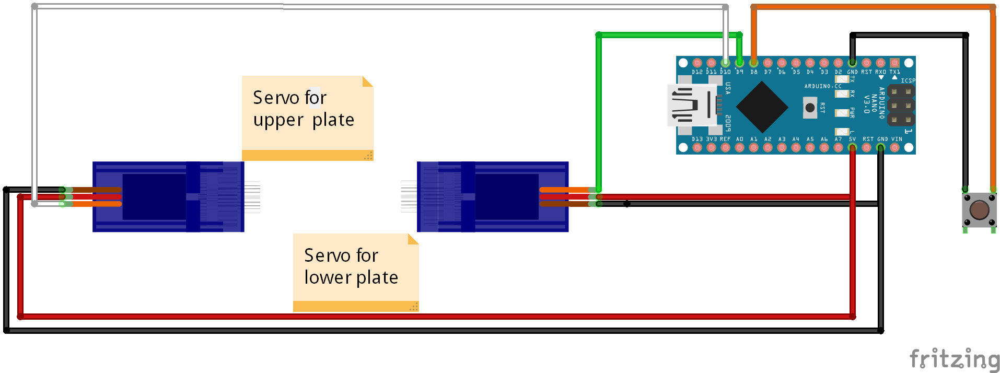

# SMD_Flipper
Device to flip SMD components, especially useful for manual pick and place machine

## Hardware
- 2 x SG90 servo motor
- Arduino Nano or ATTiny85
- button to start the flipping process

The Servos can be controlled by an Arduino Nano. I also tried to
control it with an ATTiny. This works but for convinience I
switched back to an Arduino Nano.

The button is used to start the flipping process and after the
flipping the servos are deactivated by switching off the control
line of the servos.

## Software
### Arduino Nano version
- [Arduino IDE](https://www.arduino.cc/en/main/software) (V 2.3.2)
- [PrecisionServo](https://github.com/ElizabethTeaches/PrecisionServo) by Elizabeth Teaches

### ATTiny85 version
- [Arduino IDE](https://www.arduino.cc/en/main/software) (V 2.3.2)
- Board support "attiny by Deavind A. Mellis" (V 1.0.2)
  - add Additional boards manager URL in Preferences: https://raw.githubusercontent.com/damellis/attiny/ide-1.6.x-boards-manager/package_damellis_attiny_index.json
  - set board to attiny->ATtiny25/45/85
  - set Processor to ATtiny85
  - set clock to Internal 16MHz
  - set to your Programmer
  - Burn Bootloader
  - Upload Using Programmer

## Author
[Marco Graf](https://github.com/grafmar)
